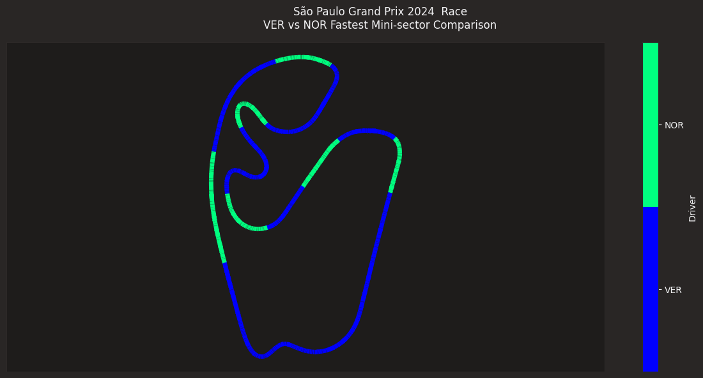
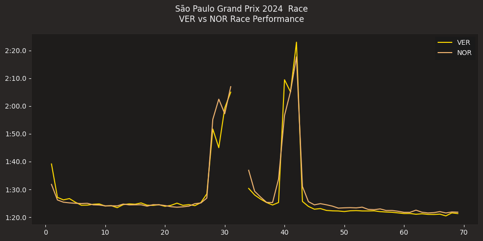
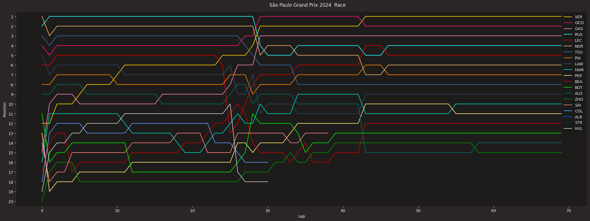

# Formula 1 2024 Brazil Grand Prix Analysis

The 2024 Brazil Grand Prix was one of the most thrilling Formula 1 races in recent times and could very well be a career-defining moment for Max Verstappen. Starting from 17th on the grid, Verstappen delivered a masterclass performance, storming through the field to claim victory at São Paulo. Watching this incredible race unfold kept me on the edge of my seat the entire time and inspired me to dive deeper into the data behind the event.

This project explores the data from the 2024 Brazil Grand Prix, focusing on telemetry, lap times, and race dynamics. By visualizing various aspects of the race, we aim to uncover the strategies and performances that shaped this unforgettable Grand Prix.

## Key Features

### 1. Mini-Sector Performance Map
The mini-sector map showcases the fastest driver per track segment between Max Verstappen (VER) and Lando Norris (NOR). Each mini-sector is color-coded based on the driver who achieved the highest speed, providing insights into how car setups and driving styles played a role across the circuit. For example:
- Verstappen consistently dominated straights, indicating superior top-end speed.
- Norris excelled in certain technical corners, showcasing McLaren’s agility in tight sections.



---

### 2. Lap-by-Lap Performance Comparison
This plot tracks the lap times of Max Verstappen (VER) and Lando Norris (NOR) throughout the race. It highlights:
- **Pit Stop Strategy:** Sudden spikes in lap times indicate pit stops, providing insights into when and how each driver executed their strategy.
- **Recovery Drive:** Verstappen’s consistent and rapid lap times illustrate how he managed to climb through the field after starting from 17th.
- **Pace Comparison:** The comparison reveals that both drivers had competitive race pace, but Verstappen's consistency under pressure gave him the edge.



---

### 3. Position Changes Over the Race
This visualization tracks the position of every driver across all laps, painting a clear picture of the race's dynamics. Key takeaways include:
- **Verstappen’s Climb:** A dramatic rise from 17th to 1st demonstrates the sheer pace and strategic brilliance of Red Bull.
- **Key Battles:** Moments where driver lines converge highlight on-track battles, such as Verstappen overtaking Norris and other key drivers.
- **Strategic Decisions:** Drops in position, often linked to pit stops, reflect the strategic calls made by teams during the race.



---

## Tools and Technologies
- **Python**: The programming language used for data analysis and visualization.
- **fastf1**: For extracting and processing Formula 1 telemetry, lap times, and race data.
- **Matplotlib**: To create detailed visualizations.
- **Pandas**: For efficient data manipulation and processing.

## Insights Uncovered
- Verstappen’s **sector dominance** on the straights versus Norris’ strength in tighter corners.
- The **impact of strategy**—timely pit stops and consistent lap times contributed to Verstappen’s climb through the field.
- A visual breakdown of how **key overtakes and battles** unfolded during the race.

## How to Use
1. Clone this repository:
   ```bash
   git clone https://github.com/yourusername/F1-Brazil2024-Analysis.git

2. Install the required dependencies:
   ```bash
   pip install fastf1 matplotlib pandas

2. Run the Jupyter Notebook to explore the analysis::
   ```bash
   jupyter notebook F1_Brazil2024_analysis.ipynb

## Acknowledgements 
- This analysis was made possible using the [Fast-F1 library](https://github.com/theOehrly/Fast-F1), which provides access to Formula 1 timing and telemetry data.
- Special thanks to [Towards Formula 1 Analysis](https://medium.com/towards-formula-1-analysis) for providing inspiration and insights into Formula 1 data analysis techniques.
